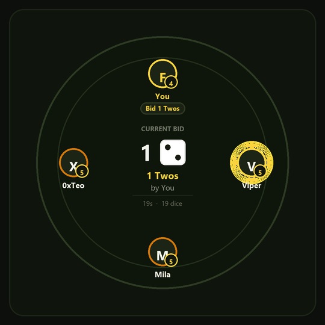

# Bluff

You win by knowing who is lying.

Five dice under every cup. You bid on how many dice of a face exist across the
entire table. You can raise the bid or call someone a liar. When bluff is called,
all cups lift. Someone loses a die. Last one standing with dice takes the pot.

Built for the Solana Blitz v9 Hackathon, with MagicBlock doing three jobs that
nothing else can do.

<p align="center">
  
</p>

<p align="center">
  <a href="https://bluff-liar-dice-tawny.vercel.app"><b>🎮 Live Web App</b></a> &nbsp;•&nbsp;
  <a href="./bluff.pdf"><b>📑 Architecture & Engineering Deck (PDF)</b></a> &nbsp;•&nbsp;
  <a href="https://explorer.solana.com/address/DtPSuiwYsauE5PwRWZfYpu2ZeCxZ7iunSZhXvHFWWfx7?cluster=devnet"><b>🔍 Solana Devnet Explorer</b></a>
</p>

## Why it needs a rollup

**The dice are sealed.** They live in an account delegated to a Private ER whose
permission has no members at all, so the program inside the rollup can read them
and nobody else can — not the other players, not the host, not the node operator.
If dice were visible on-chain anyone could count the table and the game would be
pointless. On a public chain the only alternative is commit-reveal: multiple
transactions per player per round, doubled latency, and anyone who declines to
reveal stalls the round. In a fast-paced game of deception, that is unplayable.

**Sub-second turns with gasless sessions.** Bidding happens in seconds: raise,
raise, call bluff. Signing wallet approval popups and waiting for base layer
confirmations on every single bid kills the psychological momentum. Session keys
inside the rollup let players bid and challenge with sub-50ms finality and zero
fees.

**The money never leaves Solana.** Stakes sit in a vault PDA that is never
delegated. The rollup runs the table rounds and decides who won; it cannot pay
anybody. Settlement happens on the base layer from state the rollup committed back
and this program checked.

## Game Rules & Mechanics

Bluff is an on-chain, high-stakes game of **Liar's Dice** powered by MagicBlock Private Ephemeral Rollups and Solana.

### 1. Objective
Be the last player standing with dice under your cup to win the accumulated SOL pot.

### 2. Table Setup & Buy-in
* **3 to 6 Players**: Tables support between 3 and 6 seated players. Solo hosts can seat AI bot players (with distinct archetypes: Conservative, Bluffer, Skeptic) to play anytime.
* **Equal Stakes**: Each player deposits an entry fee (e.g., 0.01 SOL) into the non-delegated Solana Vault PDA. The total pot equals `Stake × Player Count`.
* **5 Dice per Player**: Every player starts with 5 six-sided dice (faces ⚀ through ⚅).
* **Hardware-Encrypted Rolls**: At the start of each round, dice are rolled inside a **MagicBlock Private TEE (Hardware Enclave)**. Only you can view the dice under your private cup; opponents and observers cannot inspect or front-run them.

### 3. Bidding & Raising Rules
Players take turns clockwise making public claims about the **total quantity of a specific die face** present across the entire table (all cups combined):
* **Initial Bid**: The first player states a quantity and face (e.g., *"Three 4s"*).
* **Escalating Bids**: Any subsequent bid must strictly escalate:
  * **Increase the quantity** with any face (e.g., *"Four 2s"* beats *"Three 5s"*).
  * **Increase the face** with the same quantity (e.g., *"Three 5s"* beats *"Three 4s"*).
* **Exact Face Matching**: Dice counts match the exact face bid (faces 1 through 6).
* **No Passing**: In Liar's Dice, checking, skipping, or passing a turn is strictly forbidden.

### 4. 20-Second Turn Clock & Anti-AFK Penalty
* On your turn, you have exactly **20 seconds** to either place a higher bid or call "Bluff!".
* **Anti-AFK Protection**: If a player's turn clock expires at 0 seconds, they **immediately forfeit 1 die** for inactivity. An idling player loses a die every round and is eliminated within 5 rounds, preventing stalled games or freeloading.

### 5. Showdown & Calling "Bluff!"
Instead of raising, any player can challenge the previous bid on their turn by calling **"Bluff!"**:
1. **Cups Lift Simultaneously**: The TEE enclaves decrypt all player hands and reveal every die on the table.
2. **Count Matching Dice**: The total number of dice matching the bid face is tallied.
3. **Die Deduction**:
   * **If the bid was true** (actual matching dice $\ge$ bid quantity): The bid was legitimate. The **challenger loses 1 die**.
   * **If the bid was a bluff** (actual matching dice $<$ bid quantity): The bidder was caught lying. The **bidder loses 1 die**.
4. **Elimination**: When a player loses all 5 dice, they are eliminated from the table. Surviving players re-roll their remaining dice for the next round.

### 6. Pot Settlement & Heads-Up Tiebreak
* **Solo Champion (100% of the Pot)**: If you eliminate all opponents and are the last player standing with dice, you win 100% of the table pot.
* **Heads-Up Final 2 Tiebreak**: When the table is down to the final 2 finalists, the door vote tallied during room creation decides how a tiebreak is resolved:
  * **Split Pot (50/50)**: The two surviving finalists share the pot equally.
  * **Winner Takes All**: An on-chain VRF coin flip picks 1 sole winner for 100%.
  * *(A tie in table votes always defaults to Split Pot).*
* **On-Chain Payout (`settle`)**: Clicking **"CLAIM POT"** calls the `settle` instruction on Solana Devnet. The smart contract validates verified survivors and transfers SOL lamports directly from the Vault PDA to the winner's wallet.

---

## How to Play (Step-by-Step)

1. **Connect Your Wallet**: Click **"Connect Wallet"** in the top navigation. Bluff supports Phantom, Solflare, browser wallets, or temporary local devnet keypairs. Use the **"+1 SOL"** airdrop button to fund your devnet wallet.
2. **Open or Join a Table**:
   * **Host a Table**: Click **"PLAY NOW"** $\rightarrow$ choose your tiebreak preference (Split Pot vs Winner Takes All) $\rightarrow$ click **"Open it"**. You can seat AI bots or share your 1-click invite link with friends.
   * **Join a Table**: Paste a room code or open an invite link (`?room=host:roomId`) $\rightarrow$ review table details $\rightarrow$ click **"Take the seat"**.
3. **Launch the Game**: When 3 or more players are seated, the host clicks **"Start Game"**. The room is locked, delegated to the MagicBlock TEE validator, and dice are sealed.
4. **Play Your Turns**:
   * Inspect your secret dice in the private tray.
   * Watch the table's current highest bid and turn indicator.
   * When it's your turn, use the **Bid Controls** to raise the quantity/face, or click **"CALL BLUFF!"** if you believe the claim is impossible.
5. **Showdown & Round Progression**: View the cups lift on the showdown screen. Watch opponents lose dice until only the champion remains.
6. **Claim Your Winnings**: When the game concludes, click **"CLAIM POT"** to transfer your SOL prize directly into your wallet.

## Layout

```
app/               Next.js App Router (layout, page, API route handlers for table sync)
components/        React components (live table, private dice tray, 3D dice, AI bots)
lib/               Solana client SDK, TEE session keys, VRF & IDL decoders
programs/bluff/    the Anchor program
scripts/           IDL-driven client and test runs
```

## Running it

```bash
anchor build && cargo test -p bluff   # 45 tests (16 unit + 29 integration)
cd scripts && bun run session.ts      # the whole game, live on devnet
bun dev                               # Next.js web app, at http://localhost:3000
bun run build                         # Next.js production build for Vercel
```

## Deploying to Vercel

The web application is built with **Next.js (App Router)** and structured at the repository root for seamless 1-click deployment on **Vercel**:
1. Import this repository into Vercel.
2. Vercel automatically detects Next.js.
3. Deploy with zero configuration overrides.

## Testing and Invariant Verification

The on-chain protocol includes 45 deterministic tests (16 in-memory unit tests plus 29 integration tests running against the compiled BPF binary via LiteSVM). This executes transactions directly against the program bytecode in milliseconds without needing an external validator cluster.

To execute the test suite:

```bash
anchor build
cargo test -p bluff
```

### Test Coverage Breakdown

1. **Room Lifecycle and Vault Constraints (`tests/room_lifecycle.rs` - 19 tests)**
   - **Initial State**: Verifies new rooms initialize in the Open phase with exact stake and host parameters.
   - **Privacy Headroom**: Confirms the sealed answers account carries sufficient rent-exempt headroom to self-fund private rollup permissions.
   - **Vault Isolation**: Ensures stakes reside in a program-derived vault PDA that is never delegated to the rollup.
   - **Seat Access Control**: Rejects duplicate seating by the same wallet and enforces table capacity limits (3 to 6 players).
   - **Refund Guarantees**: Confirms players leaving an open room receive their stake back without disturbing remaining seats.
   - **State Locking**: Locks the room once round one begins, rejecting further joins and preventing mid-game exits.
   - **Session Key Authorization**: Validates that delegated session keys are tied to specific seats and cannot act on behalf of unauthorized wallets.

2. **Settlement and Payout Safety (`tests/settlement_tests.rs` - 10 tests)**
   - **Winner Payouts**: Single survivors collect the accumulated pot, while ties split proceeds evenly.
   - **Rent Exemption Invariant**: Proves the vault PDA remains exactly at its rent-exempt minimum after all payouts.
   - **Deadlock Refunds**: Fully refunds all seated participants if all players are eliminated simultaneously.
   - **Anti-Tampering Checks**: Rejects payouts if the provided winner list is incomplete, swapped, or does not match the attested survivors.
   - **Idempotency**: Prevents double-settlement on already paid-out rooms.
   - **Permissionless Trigger**: Allows any caller to trigger the payout as long as the payout recipients strictly match verified game survivors.

3. **Core Instruction Logic (`src/instructions/` - 16 unit tests)**
   - Verifies round resolution, tiebreaks, queue arithmetic, and ephemeral delegate layout offsets.

## Documentation & Presentation Deck

- **Architecture & Engineering Slide Deck**: [`bluff.pdf`](./bluff.pdf) (or view online at [`bluff-liar-dice-tawny.vercel.app/bluff.pdf`](https://bluff-liar-dice-tawny.vercel.app/bluff.pdf)).
- **Architecture Validation Log**: [`ARCHITECTURE.md`](ARCHITECTURE.md) records what was proven before any of this was written.
